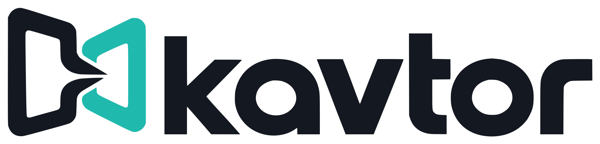

# kavtor



A professional live video mixer control plane and preparation workspace,
powered by CasparCG + [casparMIX](https://github.com/kavtor/casparMIX).
kavtor follows traditional switcher workflows: PGM/PST, cascaded M/Es,
NEXT TRANSITION, independent keyers/DSKs, manual T-bar and delegated sources.
The Qt application prepares inputs, outputs, layouts and effects;
[faderOS](https://github.com/faderOS/faderOS) provides physical-panel operation.

Current topology: four M/Es, four upstream keys per M/E and two DSKs. Native
rendered routes isolate complete compositions and synchronize reentries.
Native multiview, Sony-numbered wipe/DME catalogues, per-M/E SuperSource
instances, editor tools and source-aware MOVE are implemented. Some catalogue
interpretations await operator review; stinger/matte and advanced key processing
remain under development. See the [roadmap](docs/roadmap.md).

## Build

Linux, CMake 3.20+, a C++17 compiler, Qt 6 and hidapi are required. Node.js
enables geometry tests; optional NDI diagnostics require a separate NDI SDK.

```sh
cmake -S . -B build -DCMAKE_BUILD_TYPE=Release
cmake --build build --parallel
QT_QPA_PLATFORM=offscreen ctest --test-dir build --output-on-failure
build/kavtor --help
build/kavtor --connect
```

Production rendering requires CasparCG 2.5.1 with casparMIX 0.17.0 or later.
Local tests use fake protocol peers and do not require a renderer. Hardware/NDI
acceptance and engine overload testing are documented separately. The current
Linux setup is the validated development platform, not a cross-platform guarantee.

Settings use `~/.config/kavtor/switcher.json`. On first use, a prior
`~/.config/strata/switcher.json` is imported only if no kavtor file exists; the
original is retained. Personal source names and routes are not rewritten.

## Documentation

- [Browser touch preparation](docs/touch-surface.md)
- [Preparation workspace](docs/management.md)
- [Architecture and development](docs/development.md)
- [Panel/control API](docs/panel-protocol.md)
- [Transitions](docs/transitions.md), [keyers](docs/keyers.md)
- [SuperSources](docs/supersources.md), [MOVE](docs/move-transition.md)
- [Sony catalogue inventory](docs/sony-dme-inventory.json)
- [A/V investigation](docs/av-sync-investigation.md) and [renderer recovery](docs/renderer-recovery.md)
- [Brand assets and printable labels](branding/README.md)

Clips can play locally, but external NDI/SDI playout/replay is the principal
production arrangement. Instant replay and more advanced playback policies
are roadmap work. No private media, endpoint configuration or Sony manuals
are bundled. This is an early development release, licensed under [GNU GPLv3](LICENSE).
Contribute through [issues and PRs](CONTRIBUTING.md).
